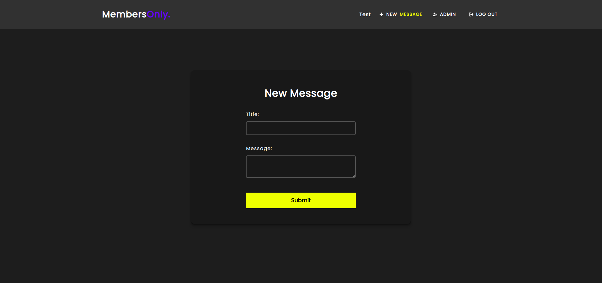

# Members Only App

🔗 [View Demo](https://members-only-app-6gk8.onrender.com)

## Table of Contents
- [About The Project](#about-the-project)
- [Built With](#built-with)
- [Screenshots](#screenshots)
- [Features](#features)

## About The Project
A Members Only Application which incorporates levels of exclusivity.

## Screenshots

### Explore Messages (Non-Member)

### Explore Messages (Non-Member - Logged In)

### Become a Member

### Sign Up Form
  

### Log In Form
  

### Explore Messages (Member)
 

### New Message

### Admin Privileges
 

### Explore Messages (Admin)
 

[Back to Top](#members-only-app)

## Built With

---

🔏 **Passport.js**

🔑 **Bcrypt**

[Back to Top](#members-only-app)

## Features

- Explore Messages Page
- Sign Up & Log In Forms
- Form Validation & Secure Passwords with Bcrypt
- Members Can Create New Messages
- Members Can View the Date & Author of Messages
- Ability to Delete Messages as an Admin
- Non-Members See a List of Messages but the Authors Name and Date is Hidden
- Ability to Become a Member
- Responsive User Interface

[Back to Top](#members-only-app)
